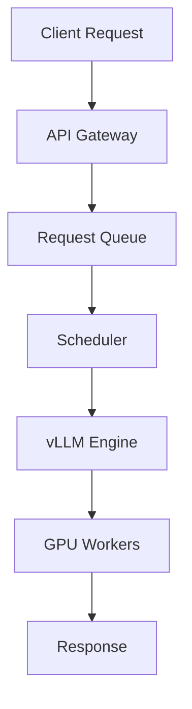

# Portfolio Development Guide

## Introduction

Your portfolio is your professional showcase. It demonstrates your capabilities beyond what a resume can convey. For ML infrastructure roles, a strong portfolio can differentiate you from other candidates.

**Goal**: Build 3-5 portfolio-worthy projects that demonstrate vLLM and GPU expertise

---

## What Makes a Portfolio Project?

### Criteria for Portfolio-Worthy Projects

**Technical Depth**:
- Demonstrates substantial technical skill
- Shows understanding of complex concepts
- Includes optimization or advanced features

**Practical Value**:
- Solves a real problem
- Could be used by others
- Production-quality code

**Clear Documentation**:
- Well-written README
- Code comments
- Architecture diagrams
- Performance benchmarks

**Evidence of Learning**:
- Shows progression
- Documents challenges and solutions
- Includes metrics and results

---

## Project Selection from vLLM Curriculum

### Tier 1: Must-Have Projects (Choose 2-3)

**Project 1: Custom vLLM Scheduler**
```
What: Implement priority-based scheduling with SLA guarantees
Why: Shows understanding of vLLM internals, system design
Complexity: Medium-High

Portfolio Elements:
• GitHub repo with clean code
• Benchmark comparison vs default scheduler
• Documentation of design decisions
• Performance graphs

Talking Points:
- Explain scheduling algorithms
- Discuss trade-offs (fairness vs throughput)
- Show performance improvements
```

**Project 2: CUDA Kernel Optimization**
```
What: Optimize attention or other kernels, document process
Why: Demonstrates low-level GPU expertise
Complexity: High

Portfolio Elements:
• Before/after code with explanations
• Nsight Compute profiles showing improvements
• Roofline analysis
• Blog post documenting optimization journey

Talking Points:
- Walk through optimization techniques
- Explain profiling methodology
- Quantify improvements (2x, 3x, etc.)
```

**Project 3: Distributed Inference System**
```
What: Multi-GPU serving with load balancing and monitoring
Why: Shows production engineering skills
Complexity: High

Portfolio Elements:
• Complete system architecture
• Deployment instructions (Docker/K8s)
• Monitoring dashboards (Grafana)
• Load testing results

Talking Points:
- Discuss scalability strategies
- Explain fault tolerance
- Show real-world deployment
```

### Tier 2: Strong Supporting Projects (Choose 1-2)

**Project 4: Quantization Pipeline**
```
What: Automated pipeline for model quantization and evaluation
Why: Shows ML production expertise
Complexity: Medium

Portfolio Elements:
• Support multiple quantization methods (GPTQ, AWQ, INT8)
• Automated benchmarking
• Comparison reports
• Easy-to-use CLI
```

**Project 5: Benchmarking Framework**
```
What: Comprehensive tool for benchmarking LLM serving
Why: Shows attention to measurement and rigor
Complexity: Medium

Portfolio Elements:
• Configurable workload patterns
• Statistical analysis
• Visualization of results
• Comparison against baselines
```

**Project 6: vLLM Contribution**
```
What: Merged PR to vLLM open-source project
Why: Shows you can contribute to real projects
Complexity: Varies

Portfolio Elements:
• Link to merged PR
• Description of contribution
• Discussion of review process
• Impact on project
```

---

## GitHub Portfolio Setup

### Repository Structure

```
your-username/
├── vllm-learning-projects/
│   ├── README.md (Overview of all projects)
│   ├── 01-custom-scheduler/
│   │   ├── README.md
│   │   ├── src/
│   │   ├── benchmarks/
│   │   ├── docs/
│   │   └── results/
│   ├── 02-cuda-optimization/
│   ├── 03-distributed-serving/
│   └── ...
├── your-username.github.io/ (Personal website)
└── blog-posts/ (Technical writing)
```

### Perfect README Template

````markdown
# Project Name

> One-sentence description of what this does

[](link)
[](link)

![Demo GIF or Screenshot]

## Overview

**Problem**: What problem does this solve?

**Solution**: High-level approach

**Results**: Key metrics and improvements

## Quick Start

```bash
# Installation
pip install -r requirements.txt

# Run example
python examples/demo.py
```

## Architecture

[Diagram here]

**Components**:
- Component 1: Description
- Component 2: Description

## Performance

| Metric | Baseline | This Project | Improvement |
|--------|----------|--------------|-------------|
| Latency | 100ms | 50ms | 2x faster |
| Throughput | 50 RPS | 120 RPS | 2.4x |

[Charts showing results]

## Implementation Highlights

### Key Technical Decision 1

```python
# Show important code snippet
```

Why this approach: Explanation

### Key Technical Decision 2

...

## Benchmarking

```bash
python benchmarks/run.py --config benchmarks/config.yaml
```

Results: [Link to full results](results/benchmark_results.md)

## Development

### Setup

```bash
# Dev setup instructions
```

### Testing

```bash
pytest tests/
```

### Contributing

Contributions welcome! See [CONTRIBUTING.md](CONTRIBUTING.md)

## Lessons Learned

1. **Lesson 1**: What you learned
2. **Lesson 2**: What you learned
3. **Lesson 3**: What you learned

## Future Work

- [ ] Feature 1
- [ ] Feature 2
- [ ] Feature 3

## References

- [vLLM Paper](link)
- [Related Work](link)

## License

MIT License - see [LICENSE](LICENSE)

## Author

**Your Name**
- GitHub: [@your-username](link)
- LinkedIn: [Your Name](link)
- Email: your.email@example.com
````

---

## Documentation Best Practices

### Code Comments

**Good Comments**:
```python
class PagedAttentionKernel:
    """
    Implements PagedAttention algorithm for efficient KV cache management.

    Unlike traditional attention which requires contiguous KV cache,
    PagedAttention splits cache into blocks that can be non-contiguous,
    eliminating fragmentation.

    Key algorithm details:
    - Block size: 16 tokens (configurable)
    - Block table maps logical positions to physical blocks
    - Supports copy-on-write for prefix sharing

    Performance: Achieves 80% of vLLM reference implementation.
    Memory utilization: 2-3x better than naive approach.
    """

    def forward(self, query, key_cache, value_cache, block_table):
        """
        Compute attention using paged KV cache.

        Args:
            query: [batch, seq_len, num_heads, head_dim]
            key_cache: [num_blocks, block_size, num_heads, head_dim]
            value_cache: [num_blocks, block_size, num_heads, head_dim]
            block_table: [batch, max_blocks] - maps logical to physical blocks

        Returns:
            output: [batch, seq_len, num_heads, head_dim]

        Note: This implementation uses vectorized loads (float4) for better
        memory bandwidth utilization.
        """
```

**Bad Comments**:
```python
# Process the data
def process(data):
    # Loop through items
    for item in data:
        # Do something
        result = item * 2  # Multiply by 2
        # Return result
        return result
```

### Architecture Diagrams

Use tools like:
- **Excalidraw**: Simple, clean diagrams
- **draw.io**: More sophisticated
- **Mermaid**: Code-based diagrams in Markdown

Example:


---

## Personal Website / Portfolio Site

### Option 1: GitHub Pages (Free, Easy)

**Using Jekyll**:
```bash
# Create site
git clone https://github.com/your-username/your-username.github.io
cd your-username.github.io

# Choose theme (e.g., minimal-mistakes)
# Add _config.yml, content
# Push to GitHub

# Live at: https://your-username.github.io
```

**Content Structure**:
- **Home**: Brief intro, links to projects
- **Projects**: Portfolio project showcases
- **Blog**: Technical posts (optional)
- **About**: Background, skills, contact

### Option 2: Custom Domain (Professional)

Buy domain ($10-15/year), point to GitHub Pages or host separately

### Content to Include

**Homepage**:
```
[Your Name]
GPU Systems Engineer | ML Infrastructure

[Professional headshot]

I specialize in high-performance LLM serving, CUDA optimization,
and distributed inference systems. Currently deep-diving into vLLM
and preparing for roles at [Target Companies].

[Projects] [Blog] [GitHub] [LinkedIn]
```

**Projects Page**:
For each project:
- Screenshot/demo
- One-paragraph description
- Key technologies
- Results/impact
- Links (GitHub, live demo)

**Blog** (Optional but valuable):
Write 2-3 technical posts:
1. "Building PagedAttention from Scratch"
2. "Optimizing CUDA Kernels: A Case Study"
3. "Distributed LLM Serving at Scale"

Benefits:
- Demonstrates communication skills
- Searchable (SEO)
- Shareable in interviews

---

## Presenting Your Portfolio in Interviews

### Opening Statement

"I'd love to walk you through my vLLM learning project. Over the past 6 months, I've built several systems that demonstrate my GPU and distributed systems expertise. Would you like me to showcase my custom scheduler implementation or my CUDA optimization work?"

### Project Walkthrough (5 minutes)

1. **Problem (30 sec)**: What you were trying to solve
2. **Approach (2 min)**: High-level architecture and key decisions
3. **Implementation (1.5 min)**: Interesting technical details
4. **Results (1 min)**: Metrics and impact

### Be Ready to Go Deep

Interviewers may probe:
- "Show me the code for X"
- "How would you modify this for Y scenario?"
- "What were the biggest challenges?"
- "How does this compare to production vLLM?"

Having the repo open allows you to show real code.

---

## Portfolio Checklist

### Code Quality
- [ ] Clean, readable code with consistent style
- [ ] Type hints (Python)
- [ ] Docstrings for functions/classes
- [ ] No obvious bugs or security issues
- [ ] Tests included (even basic ones)

### Documentation
- [ ] Comprehensive README
- [ ] Installation/usage instructions work
- [ ] Architecture diagram included
- [ ] Performance benchmarks documented
- [ ] Lessons learned section

### Presentation
- [ ] Screenshots or demo GIF
- [ ] Formatted nicely (syntax highlighting)
- [ ] Professional tone
- [ ] No TODO or WIP sections visible
- [ ] Contact info included

### Metrics & Results
- [ ] Quantified improvements (X% faster, Y× throughput)
- [ ] Comparison with baselines
- [ ] Charts/graphs of results
- [ ] Reproducible benchmarks

### Professional Polish
- [ ] LICENSE file
- [ ] .gitignore properly configured
- [ ] No large files in repo
- [ ] Meaningful commit messages
- [ ] GitHub repo description filled out

---

## Portfolio Maintenance

### Before Interviews

**1-2 Weeks Before**:
- [ ] Review all READMEs for typos/clarity
- [ ] Update any outdated info
- [ ] Re-run benchmarks if needed
- [ ] Test all installation instructions
- [ ] Ensure demos work

### After Projects Complete

**Immediately**:
- [ ] Write comprehensive README while fresh
- [ ] Document challenges and solutions
- [ ] Add to portfolio site
- [ ] Share on LinkedIn/Twitter (optional)

### Continuous Improvement

**Monthly**:
- [ ] Review and refine documentation
- [ ] Add new projects from learning
- [ ] Update with new skills
- [ ] Incorporate feedback from reviews

---

## Common Portfolio Mistakes

❌ **Too Many Half-Finished Projects**: Better to have 3 polished than 10 incomplete

❌ **No Documentation**: Code without explanation is hard to evaluate

❌ **Overly Simple Projects**: "Hello World" doesn't demonstrate skill

❌ **Unrealistic Projects**: Claiming you built entire distributed systems alone in a week

❌ **No Results/Metrics**: Can't evaluate impact without numbers

❌ **Messy Code**: Demonstrates lack of professionalism

✓ **Fix**: Focus on quality over quantity. Document thoroughly. Be honest about scope and collaboration.

---

## Example Portfolio Projects from Top Candidates

### Example 1: vLLM Custom Scheduler

**GitHub**: user/vllm-priority-scheduler
**Description**: Priority-based scheduler with SLA guarantees
**Stats**: 150 stars, 12 forks
**Highlights**:
- Clean implementation (500 lines)
- Comprehensive benchmarks
- 20% latency improvement for high-priority
- Blog post explaining design

### Example 2: CUDA Attention Optimization

**GitHub**: user/optimized-attention
**Description**: 5x speedup of attention kernel
**Highlights**:
- Step-by-step optimization journey
- Nsight profiles at each stage
- Detailed technical writeup
- Educational value (others learning from it)

### Example 3: Production LLM Serving

**GitHub**: user/llm-serve
**Description**: Complete serving system with monitoring
**Highlights**:
- Docker + K8s deployment
- Grafana dashboards
- Load testing framework
- Real-world production patterns

---

*Last Updated: 2025-11-19*
*Module 9: Portfolio Development Guide*
